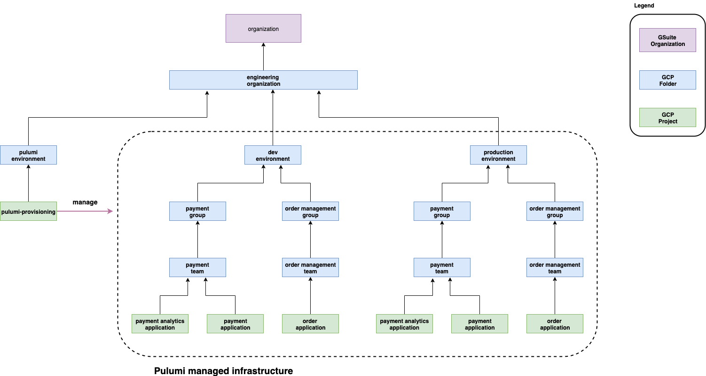

# Infrastructure As Code With Pulumi

## High Level View

The diagram below illustrates the general ideas of using Pulumi for infrastructure provisioning.

* follow the same idea as described in [../terraform/README.md](terraform), this project is aimed to produce the same infrastructure done by Terraform
* There are few resources assumed to be created beforehand either manually or by Pulumi.
* Every resources within dotted line are managed by Pulumi
* There is parity between each environment
* IAM roles are assigned at the highest folder level whenever reasonable and its sub folders and projects inherit them from that folder.
* GCP folder resources are more static while projects are more ephemeral.
* Each project consists resources for either a single application or group of closely related applications managed by the same team.
* Resources that are shared among multiple teams such as GCP Bucket, GKE Clusters, etc, are created in the shared project.




## Bootstrap Process
* Create a GCP folder under `GSuite organization`
    * example folder name: `engineering`
    * represents entire engineering organization

* Create a GCP folder under `engineering` folder
    * example folder name: `pulumi-provisioning`
    * contains resources for running Pulumi operations

* Create a GCP project under `pulumi-provisioning` folder
    * example project name: `pulumi-provisioning`
    * contains GCP Service Account for pulumi provisioning

* In GCP cnosole for the provisioning project (`pulumi-provisioning`), create a `Service Account`
    * example service account name: `pulumi-provisioning` and generate/store key in JSON format file named `pulumi-provisioning-sa.json`.

* In the `pulumi-provisioning` project, create a GCS Bucket to store Pulumi remote stack files
    * example bucket nane: `pulumi-provisioning`

* In the environment where Pulumi scripts will be executed, login to GCP using service account key
    ```
    gcloud auth activate-service-account --key-file=/PATH/TO/pulumi-provisioning-sa.json
    ```

* In the environment where Pulumi scripts will be executed, run the following bash commands to initialize python virtual environment and pulumi
    ```
    export PYTHONPATH=/PATH/TO/THIS/REPO
  
    export billing_account=GCP_BILLING_ACCOUNT
  
    virtualenv -p python3 venv

    source venv/bin/activate

    pip3 install -r requirements.txt

    pulumi login gs://pulumi-provisioning
    ```

* In GCP console for the provisioning project (`pulumi-provisioning`), enable the following APIs
    * Cloud Resource Manager API 
    * Cloud Billing API
    * Kubernetes Engine API 

* In Google Admin console, add `pulumi-provisioning` account into a group such as admin group
    * IAM roles will be assigned to this group instead of to member directly. 
    * Members in this group will then have the assigned roles

* In GCP console for the organization, configure admin group with the following IAM roles:
    * Billing Account Administrator

* In GCP console for the top level folder (`engineering`), configure admin group with the following IAM roles:
    * Folder Creator
    * Project Creator


## Directory Structure
* package: contains pulumi modules for each supported resource

* root: directory to contain all resources for all environments (`development`, `test`, etc). The `dev` subdirectory contains all resources for the `development` environment. Similarly, there can be `stage` and `prod` directories.

* Assuming under `engineering` organization there are multiple development groups, each group then owns its directory (also GCP folder).  Group level IAM roles can be assigned at this folder level.

* Under each group there can be one or more development teams, each team then owns its directory (also GCP folder). Team level IAM roles can be assigned at this folder level. 

* Within each directory, there is an `infra` sub-directory. This directory contains Pulumi scripts to 
    * Create GCP folder (or project if this directory is a leaf)
    * Assign IAM roles

* Leaf directory is directory for a GCP project. It also has an `infra` sub-directory and contains Pulumi scripts to 
    * Create GCP project
    * Assign additional IAM roles if necessary

* Project level directory also contains other sub-directories for resources this project needs.


```
├── package
├── root
│   └── dev
│       ├── group-02
│       │   ├── infra
│       │   └── team-02
│       │       ├── infra
│       │       └── project-02
│       │           ├── bucket
│       │           ├── gke
│       │           ├── infra
│       │           └── vpc
│       └── infra

```


## Provisioning

Provisioning begins from top level directory and work your way down each sub directory. 

```
dev -> group -> team -> project
```

When executing Pulumi scripts for each level (group, team, project), always executes the scripts inside `infra` directory first. This will also populate Pulumi remote stack with folder/project information such as folder-id, project-id, etc which is needed by other resources. 

## Remote State Management

The Pulumi scripts uses a GCS Bucket for storing remote states. Compared to Terraform, Pulumi uses a flat directory structure and stores all stack files in the same directory. 

What this means is that stack name should be unique across all projects/teams/groups/environments.

The suggested approach is to give each project/team/group/environment a unique stack name following a naming convention. The idea is to limit the blast radius when things go wrong. Each source directory is assigned with a unique stack name. This design also has the advantage of faster turn-around time during development when you repeat the `apply-destroy` cycle as the number of resources involved are limited to only what is declared in the same directory.

A sample stack name for the Pulumi scripts defined in `root/dev/group-01/team-01/project-01/gke` directory will be `dev-project-01-gke`


When a resource needs information from the enclosing project, we provide the stack name information in the `config.yaml` file using `parent_stack_name` key

```
parent_stack_name: "dev-group-02-infra"
```

When Pulumi script needs information such as parent folder id or project id, it can retrieve it by

```
# read config.yaml file into a dict
config = config_util.read('config.yaml')

# determine parent folder id 
parent_folder_id = config_util.get_parent_folder_id_from_stack(config)

# project specific config
project_config = config['project']

# determine project id
project_id = config_util.get_project_id_from_stack(config)
```
