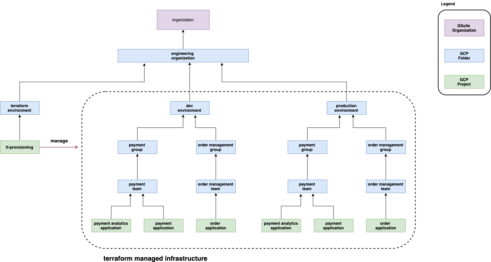

# Infrastructure As Code With Terraform

## High Level View

The diagram below illustrates the general ideas of using Terraform for infrastructure provisioning.

* There are few resources assumed to be created beforehand either manually or by Terraform.
* Every resources within dotted line are managed by Terraform
* There is parity between each environment
* IAM roles are assigned at the highest folder level whenever reasonable and its sub folders and projects inherit them from that folder.
* GCP folder resources are more static while projects are more ephemeral.
* Each project consists resources for either a single application or group of closely related applications managed by the same team.
* Resources that are shared among multiple teams such as GCP Bucket, GKE Clusters, etc, are created in the shared project.



## Bootstrap Process
* Create a GCP folder under `GSuite organization`
    * example folder name: `engineering`
    * represents entire engineering organization

* Create a GCP folder under `engineering` folder
    * example folder name: `terraform`
    * contains resources for terraform operations

* Create a GCP project under `terraform` folder
    * example project name: `tf-provisioning`
    * contains GCP Service Account for terraform provisioning

* In GCP cnosole for the provisioning project (`tf-provisioning`), create a `Service Account`
    * example service account name: `tf-provisioning` and generate/store key in JSON format file named `tf-provisioning-sa.json`.

* In the `tf-provisioning` project, create a GCS Bucket to store Terraform remote state files
    * example bucket nane: `tf-provisioning`

* In the environment where Terraform scripts will be executed, set `GCP_SERVICE_ACCOUNT_KEY` environment variable  with the content of the service account key
    ```
    export TF_VAR_GCP_SERVICE_ACCOUNT_KEY=$(cat /PATH/TO/tf-provisioning-sa.json)
    ```

* In GCP console for the provisioning project (`tf-provisioning`), enable the following APIs
    * Cloud Resource Manager API 
    * Cloud Billing API
    * Kubernetes Engine API 

* In Google Admin console, add `tf-provisioning` account into a group such as admin group
    * IAM roles will be assigned to this group instead of to member directly. 
    * Memebers in this group will then have the assigned roles

* In GCP console for the organization, configure admin group with the following IAM roles:
    * Billing Account User

* In GCP console for the top level folder (`engineering`), configure admin group with the following IAM roles:
    * Folder Creator
    * Project Creator


## Directory Structure
* modules: contains terraform modules for each supported resource

* dev: directory to contain all resources for the `development` environment. Similarily, there can be `stage` and `prod` directories.

* Assuming under `engineering` organization there are multiple development groups, each group then owns its directory (also GCP folder).  Group level IAM roles can be assigned at this folder level.

* Under each group there can be one or more development teams, each team then owns its directory (also GCP folder). Team level IAM roles can be assigned at this folder level. 

* Within each directory, there is an `infra` sub-directory. This directory contains Terraform scripts to 
    * Create GCP folder (or project if this directory is a leaf)
    * Assign IAM roles

* Leaf directory is directory for a GCP project. It also has an `infra` sub-directory and contains Terraform scripts to 
    * Create GCP project
    * Assign additional IAM roles if necessary

* Project level directory also contains other sub-directories for resources this project needs.


```
├── dev
│   └── group-01
│       ├── infra             <- script to create group-01 GCP folder
│       └── team-01
│           ├── infra         <- script to create team-01 GCP folder
│           └── project-01
│               ├── api
│               ├── bucket
│               ├── gke
│               ├── infra     <- script to create project-01 GCP project
│               └── vpc
├── prod
|   └── group-01
|       ├── infra
|       └── team-01
|           └── infra
└── modules
    ├── bucket
    ├── folder
    ├── folder-iam
    ├── gke
    ├── project
    ├── project-iam
    ├── service-account
    └── vpc
```

## Provisioning

Provisioning begins from top level directory and work your way down each sub directory. 

```
dev -> group -> team -> project
```

When executing Terraform scripts for each level (grou, team, project), always executes the scripts inside `infra` directory first. This will also populate Terraform remote state with folder/project information such as folder-id, project-id, etc which is needed by other resources. 

## Remote State Management

The terraform scripts uses a GCS Bucket for storing remote states. The directoy structure in this bucket has the same structure as the directory structure in the source repository.

What this means is that no two directories share the same prefix in the Terraform's backend configuration.

The design idea is to limit the blast radius when things go wrong. Each source directory is assigned with a unique directory within the bucket. This design also has the advantage of faster turn-around time during development when you repeat the `apply-destroy` cycle as the number of resources involved are limited to only what is declared in the same directory.

A sample backend configuration looks like the following snippet for the terraform scripts defined in `dev/group-01/team-01/project-01/gke` directory.

```
terraform {
  backend "gcs" {
    bucket  = "tf-provisioning"
    prefix  = "dev/group-01/team-01/project-01/gke"
  }
}
```

When a resource needs information from the enclosing project, we can declare a data resource section such as the following:

```
data "terraform_remote_state" "parent" {
  backend = "gcs"
  config = {
    bucket  = "tf-provisioning"
    prefix  = "dev/group-01/team-01/project-01/infra"
  }
}
```

From the directory naming convention, project id information is available from the state file stored under `dev/group-01/team-01/project-01/infra` prefix.


## Data Transformation

See [Getting Data Ready For Working With Terraform's `for_each` Meta-Argument](./docs/data_transformation.md) for how we can take data from input, transform it in a way such that we can use it together with Terraform's new `for_each` meta-argument when managing multiple resources of the same type.
